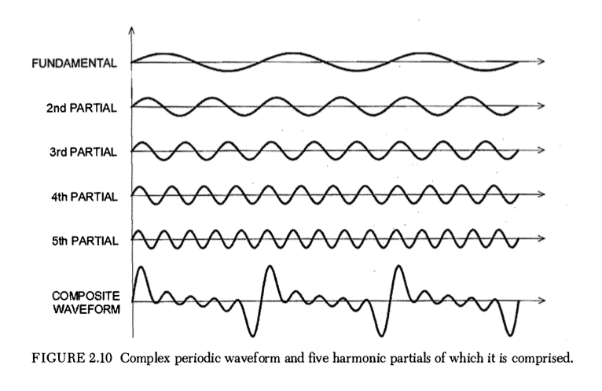
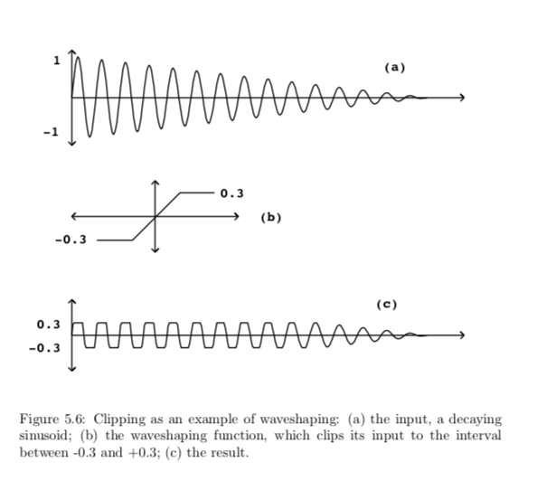
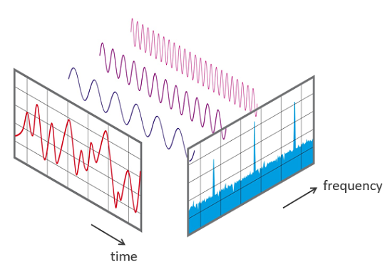
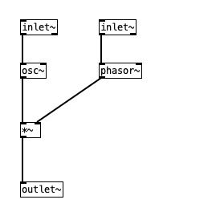
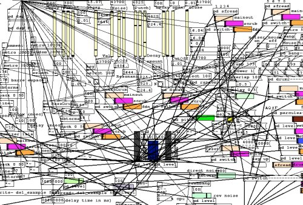

===============
About the class
===============

`week1 <../week1>`_ - `prev <../week1/why_pd.html>`_ - `next <../week1/sinusoids.html>`_

Throughout the semester we will learn about audio signals.

Generation
----------

We can generate or **synthesize** audio signals from scratch.

----

Transformation
--------------

We can transform or **modulate** audio signals with other signals.

----

Analysis
--------

We can analyze signals with various techniques (namely the `Forier Transform <https://en.wikipedia.org/wiki/Fourier_transform>`_)

----

DSP
---

**DSP** stands for **D**igital **S**ignal **P**rocessing:

.. image:: ../images/dsp.png
    :width: 400

    We will go through the various techniques that have appeared through the evolution of computer music, since its beginnings until today.

----

Small blocks
------------

Similar to Pd's code structure with an Object-Oriented Programming paradigm, the underlying structure of the class is is made of small blocks... 

with which we can build larger projects:

----

Technics
--------
We will focus on technical aspects:
    This way, you can worry about aesthetics or politics on your own time. We are here to learn, make and share things, and ways of making things. What you do with them or how you frame them is up to you.
