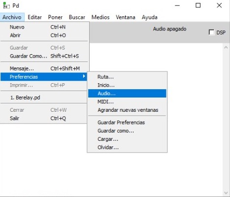
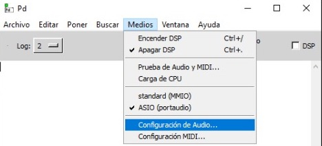
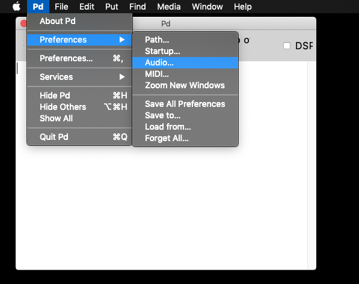
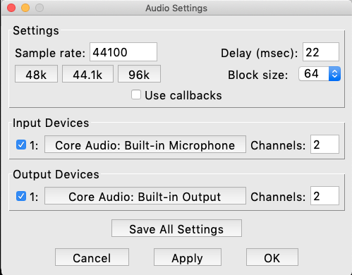
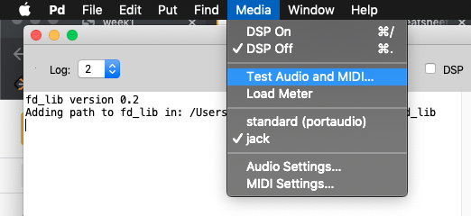
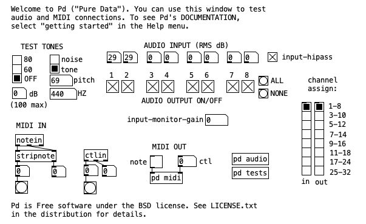

==============
Downloading Pd
==============

`week1 </week1>`_ `next </week1/why_pd.html>`_

| To download Pd, head to https://msp.ucsd.edu/software.htm and **be sure to click on the link for your platform**. The current version as of now is **Pd-0.53-0**.

- Windows:
    You can click on the *automatic installer* option. 
- Macos:
    The usual thing to do is download, double-click on the *.dmg* file, and move to the Applications folder.
- Linux:
    There are debian distros, and others, so you can go
             ``apt-get install puredata``

----

Pd's Audio Settings
===================

First of all, open Pd by double-clicking on the Pure Data executable or app file.

There are two ways to configure Audio in Pd:

-  **File / Preferences / Audio...**

-  or **Media / Audio Settings...**

- ...also (macos only) **Pd / Preferences / Audio...**

The following window will open:

**Make sure that the correct Input and Output devices are selected**

    Also, take note of the *Delay (msec)* parameter.

----

Test Audio and MIDI
===================

This is where we test that our audio is working for Pd.

Go to **Media / Test Audio and MIDI...**

The following window will open:

Click on "80" to listen to a test-tone playing at 440 Hz. 

    You can also check your Audio Input levels corresponding to each channel.
    And you can toggle the Audio Output channels ON or OFF by clicking on the boxes.

----

Audio Troubleshooting
=====================

If there is no sound, then

1. Check the obvius: 
    - Sound volumes are UP
    - Headphones are plugged-in, etc.
2. Make sure you:
    - selected the correct Audio Device in `Pd's Audio Settings`_
    - connected the Audio Device if it is periferal, or
    - set the in/out channels in `Pd's Audio Settings`_ to match your device's.

If you hear *clicks* or *pops*, then

- In `Pd's Audio Settings`_, set the *Delay (msec)* parameter higher.

    In general, this should not be above ``50`` milliseconds.

- (Windows only): make sure `MMIO` is **not** selected. Be sure to use ASIO. 

    Nowadays most audio interfaces have ASIO, so you don't need to worry about that: just select ASIO and your interface will be connected. However, if you don't have an interface, one solution is to download the latest ASIO4ALL driver (https://www.asio4all.org), install it, re-open Pd, and select ``ASIO (portaudio)`` from the **Media** menu; ASIO4ALL should open afterwards.

