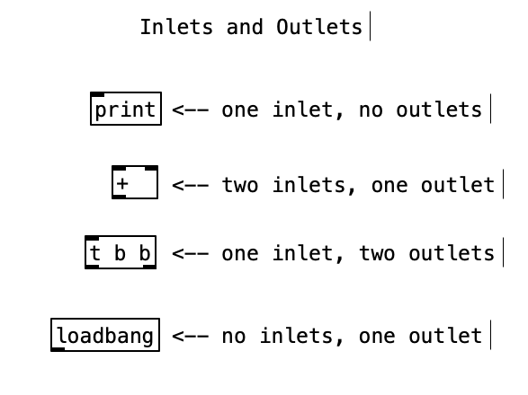
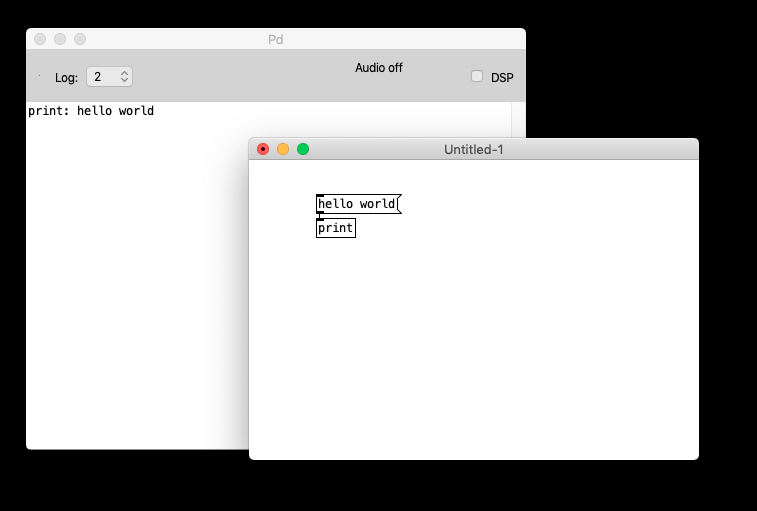
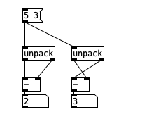

==================
Inlets and Outlets
==================

`week1 <../week1>`_ - `prev <../week1/using_pd.html>`_ - `next <../week1/exercises.html>`_

Outlets and Inlets
------------------

A Pd object is displayed on screen as a box that can generally be connected to other boxes.

These **connections** can be made by hovering with the mouse pointer over the **outlet** (thicker line at the bottom of an object), to the **inlet** (thicker line at the top of an object) of another object.

.. image:: ../images/connecting.gif
    :width: 300

    The cursor changes to a **circle** when you hover in and out of inlets and outlets, and to a **hand** when you click and drag to draw the connection cord.

Hot and Cold inlets
-------------------

The left-most inlet is known as the **hot inlet** because whenever it receives a message this causes the object to emit some output to its outlets.

In the case of the ``print`` object, which has one outlet, the message is immediately sent to (and therefore printed on) the Pd console.

However, certain objects have multiple inlets.
In these cases, the first inlet keeps the same function as above, and the rest will generaly not cause the object to output anything.
Instead they usually update internal variables of the object.
This is why the rest of the inlets are called **cold inlets**.

A group of objects that show this behavior is the ``binary`` operators for math operations like: ``+, -, *, /``

.. image:: ../images/hotcold.png
    :width: 300

As such, when you change the right-most number box which is connected to the cold inlet, nothing happens visually. But, when you change the left-most number box connected to the hot inlet, a number is displayed on the bottom number box.
    Precisely, the number output is the result of adding the left-most number to the most recent right-most number, ie. the number stored in the cold inlet.

Order of Execution
------------------

One thing that is important to know is the order in which Pd objects process their outputs.
Again, objects with one output are not an issue because the message is sent to the object's only output like the ``+`` object.
There are objects with multiple outlets.

The way Pd outputs its messages to multiple outputs is from **right to left.**

``unpack``
    The ``unpack`` object takes a **list** of messages as input and distributes them in order to every outlet, so that the first element of the list correspond to the first outlet, the second of the list to the second outlet, etc.
    The output occurs as always **from right to left**. 

This is why, in the image above the first ``-`` object computes the substraction ``5 - 3`` correctly, ie ``2``, while the second group does not.
The output of the second group is ``3``, which is the result of adding ``3`` to ``0`` which is the initial value of the ``-`` object, triggered first because it is connected to the right-most outlet of the ``unpack``.
After outputting the result, the value ``5`` is sent to the **cold inlet** of the ``-`` object.

As you can tell, it is *very important* to keep in mind the order of execution when working with Pd objects.

