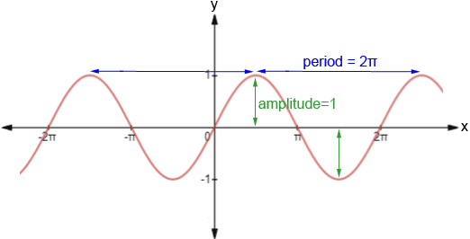
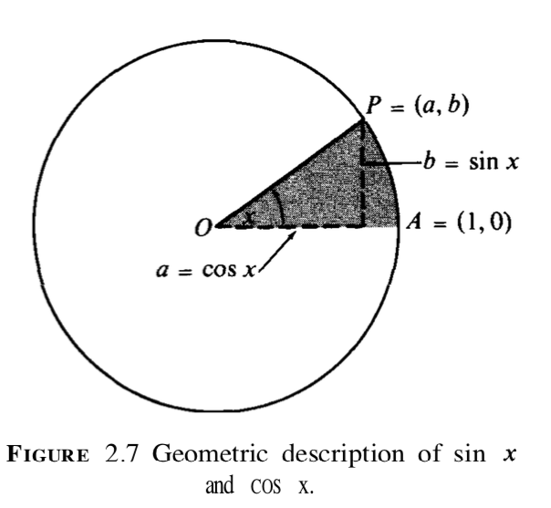
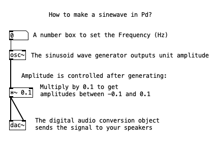

============
The Sinusoid
============

`week1 <.>`_ - `prev <../week1/about.html>`_ - `next <../week1/using_pd.html>`_

Why Sinusoids?
==============

- They are a clear example of a digital audio signal.
- Very sensitive. A general rule of thumb is:
    *If it sounds good on a sinusoid, it will probably sound good on another type of signal.*
- Think of sinusoids as a single, isolated "harmonic", so:
    *If you modify a complex spectrum, you modify each and every one of its harmonics. It is simpler to start with just one.*
- **Fourier series** uses sinusoids: 
    *Summing sinusoids can represent any periodic wave, i.e. sound*

----

Digital Representation of Signals
=================================

Digital signals are sequences that are indexed by ``n``, which is called the **sample number** ``n``

Sequence of indices
-------------------

The indices of the sequence can be represented like this:

|  ``..., n-2, n-1, n, n+1, n+2, ...``

Sequence of values
------------------

To obtain the actual values of for these indices, we need a function, call it ``f``, of the sample number. 
    A function is a mathematical term that defines a relationship between two sets, in this case, a sample number ``n`` and its output value, denoted ``f(n)``.
So, our `Sequence of indices`_ above becomes an indexed sequence of values, like this:

|  ``..., f(n-2), f(n-1), f(n), f(n+1), f(n+2), ...``

----

The sine function
=================

Given that the sinewave is an example of an audio signal, we need to find a function we can use. Luckily for us, we can make use of our trigonometry chops to use the `sine <https://en.wikipedia.org/wiki/Sine_and_cosine>`_ function. 

We can use the ``sin`` function in place of the ``f`` function above and it will give us the sine wave:

|  ``..., sin(n-2), sin(n-1), sin(n), sin(n+1), sin(n+2), ...``

    `Here <https://jackschaedler.github.io/circles-sines-signals/sincos.html>`_'s a nice visual representation by Jack Schaedler

----

Formally, we still need a few tweaks to the ``sin`` function above.
So, the actual sinusoid needs to have **all** the following parameters:

``f(n) = a • sen(ωn + ø)``
--------------------------

Where:
    - ``n`` **sample number**
    - ``a`` **amplitude**
    - ``ω`` angular **frequency**
    - ``ø`` **phase** (we can ignore this one for now)

----

How to make a sinweave in Pd
============================

This patch is real, open it with Pd `here <sinewave.pd>`_.

Go to `Using Pd <using_pd.html>`_ for a recipe.

