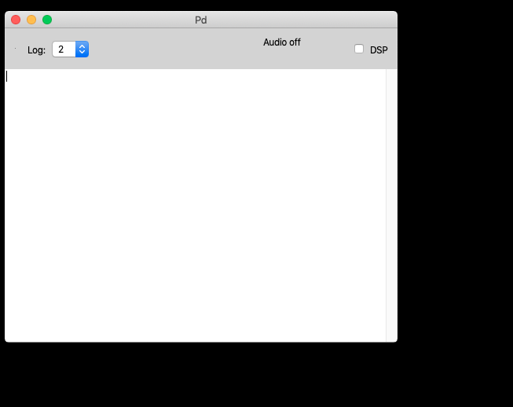
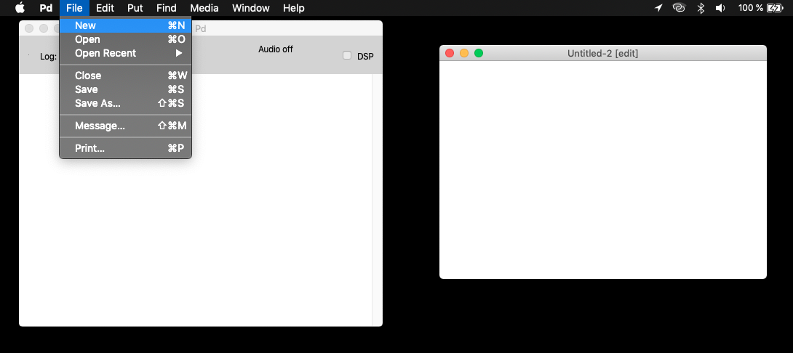
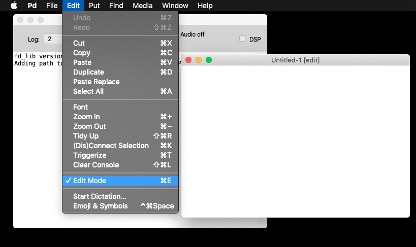
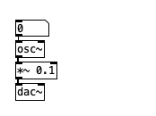

========
Using Pd
========

`week1 </week1>`_ `prev </week1/sinusoids.html>`_

The Pd console
--------------

When opening Pd you will see Pd's console window first.
This is where important debugging and other messages will be reported by Pd's internal and external objects.

A new patch
-----------

Create a Patch
^^^^^^^^^^^^^^

To start a new patch, you either click the menu entry **File / New **, or use the keyboard shortcut (recommended): 

- (linux, win) ``ctrl + N``
- (macos) ``cmd + N`` 

Another window will appear:

This window is called a *patch* and sometimes *canvas*. Within this window (and probably many others) you will make your patches.

    It is very important to know where you are located on your computer, and where to save Pd patches. For now we will not worry so much, but as patches get bigger, it gets exponentially more difficult to keep track of important files.

Save a Patch
^^^^^^^^^^^^

Now, we need to save our patch.
Click the menu entry **File / Save** or use the keyboard shortcuts (recommended):

- (linux, win) ``ctrl + S``
- (macos) ``cmd + S`` 

    From now on, I'll use ``Ctrl`` to simplify the text. Know that the key will change depending on your platform.

And voilà, you have successfully created and saved your first patch.

----

Now comes the part when whe actually do something.

Pd's 5 objects
--------------

Pure Data is such a compact program that it only offers a handful of visual or GUI (Graphicl User Interface) elements to work with.
We will use mostly the first three.

These can be summarized in the following FIVE (5) shortcuts:

- ``Ctrl + 1`` = Object
    The **object box**: it all starts with a dotted box that allows you to immediately start typing the object name, eg. ``print``
- ``Ctrl + 2`` = Message
    The **message box**: it is a box with an indented right border that allows you to immediately start typing the message to send, eg. ``hello world``. 
        This is also a GUI element that allows you to click on the box to output its contents.
- ``Ctrl + 3`` = Number
    The **number box**: is a GUI box with a clickable number that you can use to click and drag, or type a number to output it.
- ``Ctrl + 4`` = List / Symbol
    The **list/symbol** box is a GUI box enabing keyboard input for symbols or list. We will see more of these later.
- ``Ctrl + 5`` = Comment
    The **text comment** is there only to guide our future selves and others throught the flow of our program. It is wise to start using them early on. They contribute nothing to the actual program, except documentation and explanations without which our patch may become obscure.

And that's it. Now we can start patching!

----

Edit Mode
---------

The last thing you need to know is that you can interact with Pd in two ways:

You can toggle between these with the **Edit Mode** switch, either from the menu entry **File / Edit Mode** or (recommended) via the shortcut: ``Ctrl + E``

1. When **Edit mode** is turned **ON** you can edit your patches, create objects, edit text, connect boxes, etc.
2. When it is **OFF**, you can click objects, messages, and interact with the patch. 
    Sometimes this is called "run" mode, but it is really just "not-in-edit-mode".

Recipe for a sinewave
---------------------

A sinewave in 10 easy steps (no mouse involved)

1. Open Pd
2. ``Ctrl + N``
3. ``Ctrl + 3``
4. ``Ctrl + 1``
5. Type (no quotes): "``osc~``"
6. ``Ctrl + 1``
7. Type: "``*~ 0.1``" <-- **very important for this value to be 0.1**
8. ``Ctrl + 1``
9. Type: "``dac~``"
10. ``Ctrl + E``

If you followed everything *to-the-letter*, you should have:

Turning ON the DSP
------------------
If you would like to listen to this sinewave, then you need to turn DSP ON.
You can do this via the big DSP button on the Pd Console, or via the shortcuts:

|  ``Ctrl + /`` to turn it ON
|  ``Ctrl + .`` to turn it OFF

If you finished the `Recipe for a sinewave`_, you can now turn DSP ON and click and drag the number box to change the frequency of the sine wave. 
