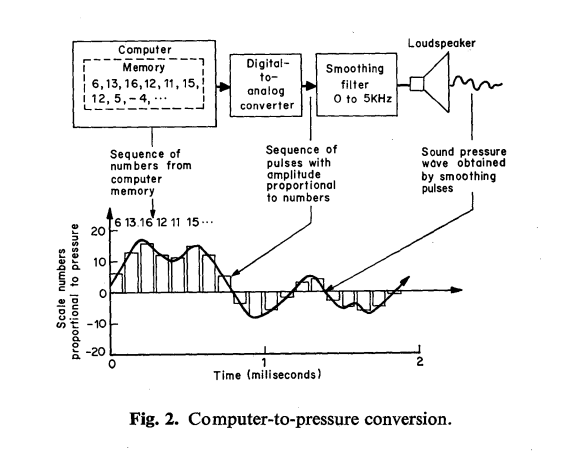

======
Week 2
======

`home <..>`_ - `syllabus <../syllabus.html>`_ - `next <sound.html>`_

The Digital Signal
------------------

In this class we introduce digital audio signals and how to generate samples with a computer. Here's a nice old-school picture by `Max Mathews <https://en.wikipedia.org/wiki/Max_Mathews>`_, a pioneer in computer music.

The topics of this week's class are:

- The sample
- Sample rate
- The Nyquist Theorem
- Aliasing
- Differences between audio and control signals.

After the class you will have some exercises and a better idea of the following Pd objects:

- ``osc~``
- ``dac~``
-  ``adc~``

Here's how we will navigate the class:

1. `Sound <sound.html>`_
2. `Digital Audio <digital_audio.html>`_
3. `Digital Audio Signal <digital_audio_signals.html>`_
7. `Exercises <exercises.html>`_

Bibliography
^^^^^^^^^^^^

Here are some interesting tutorials if you would like to dig deeper on digital audio signals:

- Brief tutorial on Floss Manuals on Pd with is `a section on digital audio <https://archive.flossmanuals.net/pure-data/introduction/what-is-digital-audio.html>`_
- The digital audio section of Kreidler's `book <http://www.pd-tutorial.com/>`_

----

Notes from class
----------------

---

In-patch classes
----------------

`Here are the patches <./patches>`_ that we made in class.
