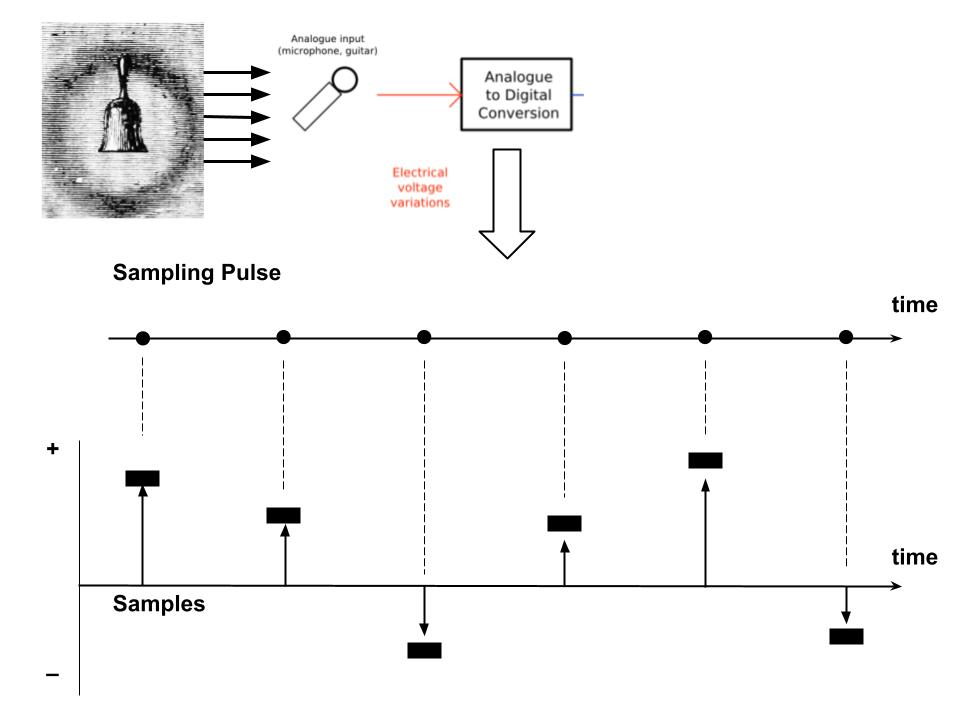

======
Sample
======

`week2 <.>`_ - `prev <digital_audio_signals.html>`_ - `next <exercises.html>`_

An audio sample is a single measure of `Amplitude`_, with a certain `Resolution`_, that corresponds to a moment in time of an electrical signal representing sound.

The diagram below summarizes this process:

To create a digital representation of the electrical signal, there must be a constant rate at which samples are taken. This is the sampling pulse above, which we generally refer to as **sampling rate**.

Amplitude
---------

The resulting signal is composed of positive and negative integers spaced at the sampling rate.
Each one of these samples holds the **amplitude** of the signal at that moment.
This constitutes the digital audio signal.

    Because of an important theorem called the Nyquist-Shannon Theorem, this signal can be (almost) fully reconstructed.
    This is why we say that the digital audio signal can represent sound.

For now, let's simply consider amplitude as the **numerical value of each sample**.

Amplitude is the base of all the digital audio field: everything relates to amplitude.

    However, amplitude is neither "volume" nor "loudness", but we will see how it affects them just as much as it affects "pitch" and "timbre".

Resolution
----------

In digital audio, each sample is represented as a **binary number**.
In binary representaiton, the size of the binary number determines the maximum number it can represent.
For example, if a number has 2 bits, then the maximum number it can represent is 4, and here are other common values:

========= ================== ================= =======================
bit depth max number         integer range     amplitude resolution
========= ================== ================= =======================
2 bit     2^2 = 4            0 to 3,           ``-3 ... 3``
4 bit     2^4 = 16           0 to 15,          ``-15 ... 15``
8 bit     2^8 = 256          0 to 255,         ``-255 ... 255``
16 bit    2^16 = 65536       0 to 65535,       ``-65535 ... 65535``
24 bit    2^24 = 16777216    0 to 2^24-1,      ``-2^24-1 ... 2^24-1``
32 bit    2^32 = 4294967296  0 to 2^32-1,      ``-2^32-1 ... 2^32-1``
========= ================== ================= =======================

As you can see, if the bit depth is low, the binary number cannot be too high.
This means that there will not be a good **resolution**. 

    For a long time digital audio was recorded in 16-bit, then came 24, and finally 32 bit as computers got faster and cheaper.
    Here's a good explanation of `32-bit depth <https://www.sounddevices.com/32-bit-float-files-explained>`_

In the visual world, this can be seen with lower resolution images:

=========== ========= ======== ======== =========
Resolution  Very Low  Low      Medium    Maximum 
=========== ========= ======== ======== =========
Image       |shan3|   |shan2|  |shan1|  |shan|  
=========== ========= ======== ======== =========

