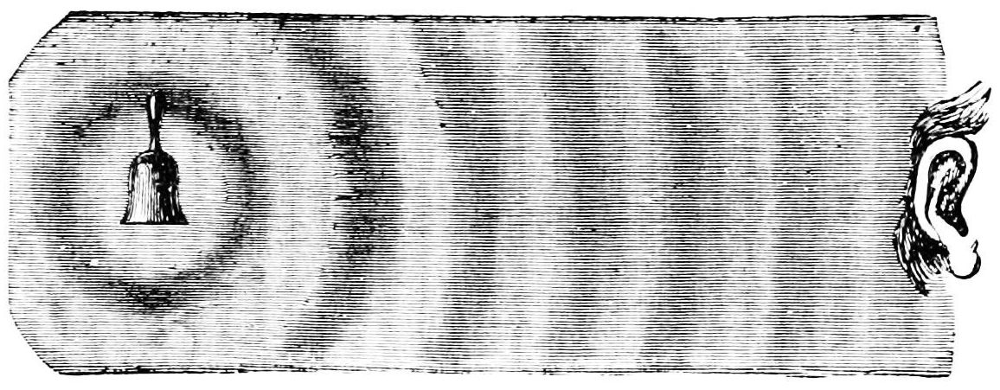
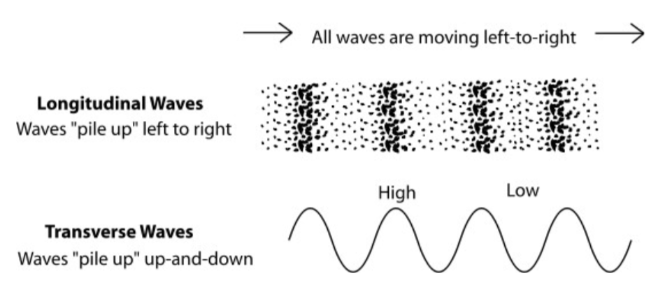
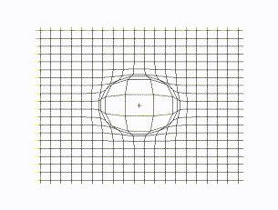
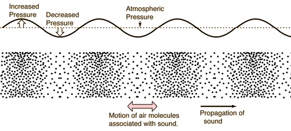
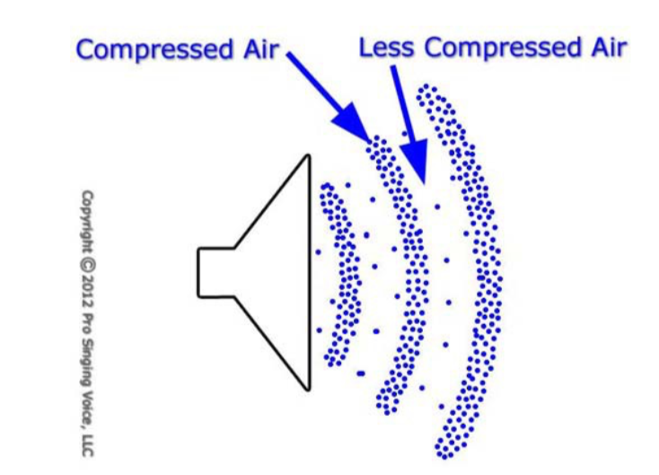
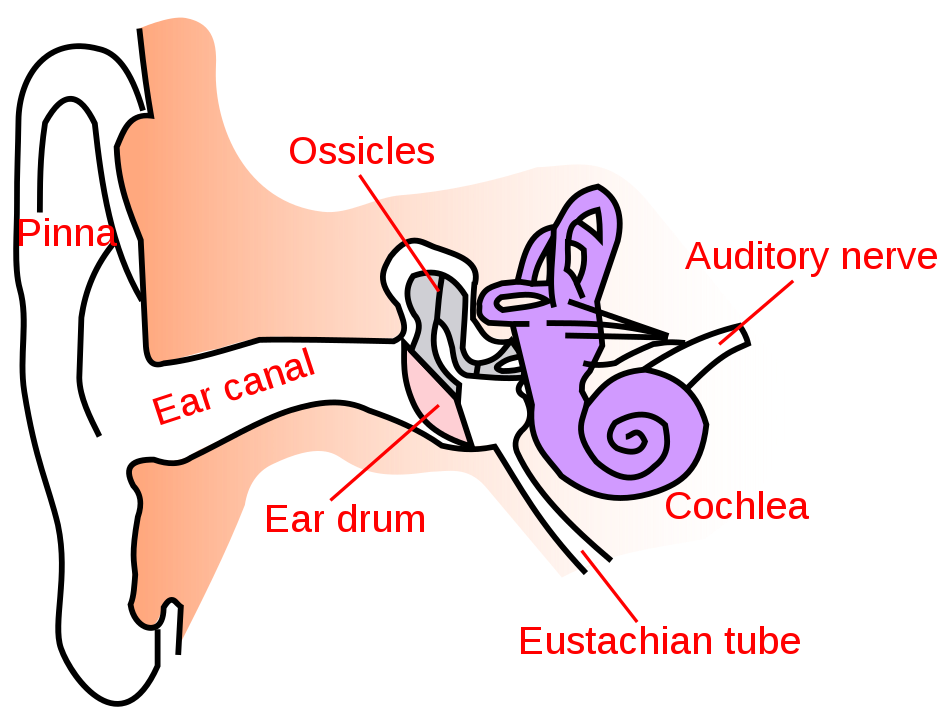

=====
Sound
=====

`week2 <.>`_ - `next <digital_audio.html>`_

There are many interpretations.
We are interested in the physical definition.

Sound
    In physics, sound is any phenomenon involving the propagation of `Mechanical Waves`_ (whether audible or not), through a **medium** (fluid or solid) that is generating the **vibratory motion of a body**.
The propagation of sound is similar in fluids, where sound takes the form of **pressure fluctuations**.

----

Let's break this into parts:

Mechanical Waves
----------------

There are two kinds of mechanical waves.

Longitudinal waves
    These move in the same direction as the wave with the contractions and rarefactions of the air molecules.

Transverse waves:
    These move perpendicular to the direction of the wave (i.e., waves on the water surface, strings on an instrument).

----

Sound is a longitudinal mechanical wave
---------------------------------------

We can think of air molecules being compressed against each other as the wave moves forward, and then decompressed as the wave passes:

Do check out this great HTML5 `visualization of longitudinal waves <http://www.phy.hk/wiki/j/Eng/Lwave/Lwave_js.htm>`_.

Audible or not
--------------

The sound audible to humans (between 20 and 20000 Hz) consists of sound waves and acoustic waves, which are created when air pressure vibrations in the human ear are converted into mechanical waves and perceived by the brain.

----
